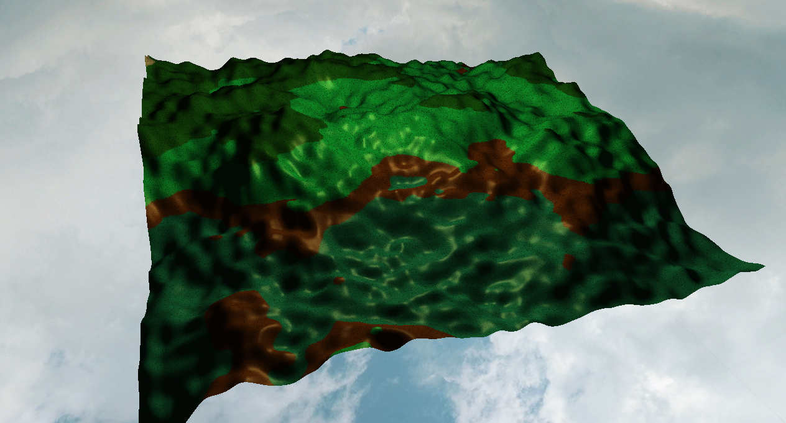
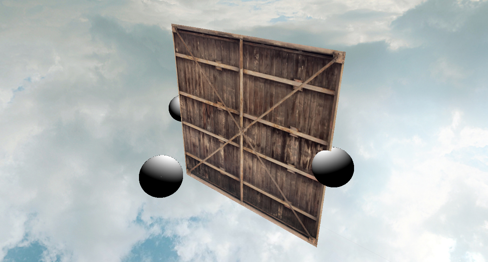

# Introduction:
A small renderer I developed through the journey of learning Computer Graphics. Currently there's no specific purpose except experimenting grapchics algorithms. So, in a sense, it's just a Hodgepodge with various "food" in different quality.

The **ongoing project** is Volumetric Real-time Cloud for my master dissertation in Newcastle University, UK.

### **Last updated: 7/18/2020**
3rd Party packages managed by [vcpkg](https://github.com/microsoft/vcpkg):
- glew
- glad
- stb
- assimp

# Current features:
### Particle system
### Particle System Update: Particle System now supports texture atlas
  

### Terrain Generation
 
A terrain generated by Perlin Noise, with a basic phong lighting model

### RayMarching(spheres) + traditional rasterization rendering
  
